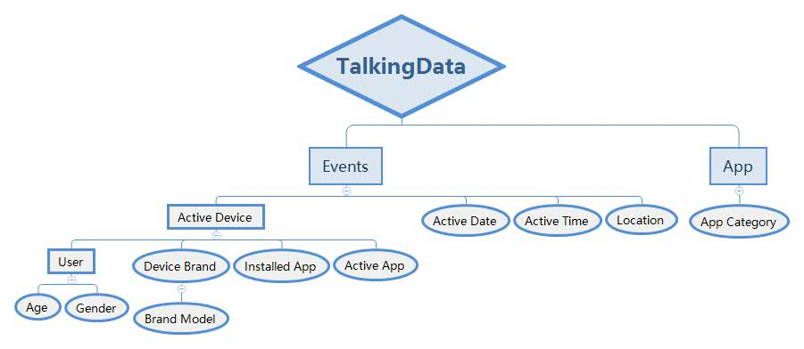
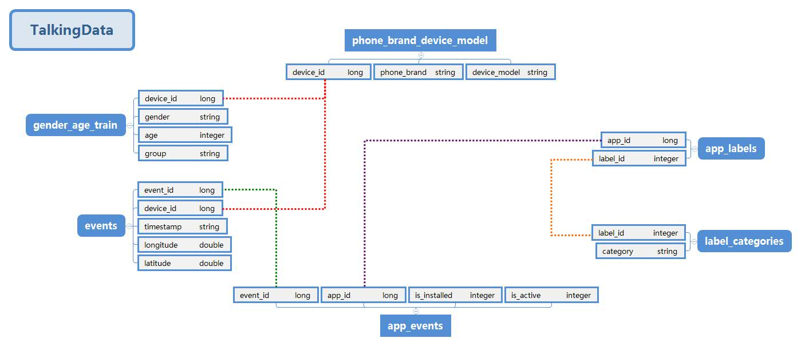

# TalkingData手機用戶預測
## 題目介紹
TalkingData是中國最大的行動數據服務平台，每天處理超過10TB 行動數據。   
本研究為Kaggle競賽，目的是藉由行動裝置的使用行為預測使用者的特徵，藉此提供用戶喜好的服務。
(https://www.kaggle.com/c/talkingdata-mobile-user-demographics)   
TalkingData透過其收集手機APP的使用行為，結合不同的手機裝置、型號以及不同的使用時間、地點，判別手機使用者的年齡、性別。

## 資料格式
當有用戶執行了包含TalkingData SDK的應用程式時，TalkingData就將其記錄為一事件(event)，並透過其獲取使用者的年齡性別、使用時間地點、使用的手機型號、開啟及安裝的程式等資料，並在內部有各APP的分類表。   
    
TalkingData將不同類型的資料分別儲存在不同的csv檔案中

|檔案名稱|檔案內容|
|---------|--|
|gender_age_train.csv| 使用者的年齡、性別、族群|
|phone_brand_device_model.csv|手機的品牌、型號|
|events.csv|使用程式的時間、地點|
|app_events.csv|相關APP的安裝、執行狀態|
|app_labels.csv|APP ID與類別ID對照表|
|label_categories.csv|類別ID與類別名稱對照表|

利用彼此共通的primary key可將各檔案進行串接   
  

## 分析流程
 - 將phone_brnad_device_model.csv中的資料進行簡繁體轉換。
 - 透過資料探索及視覺化方式進行初步欄位選擇。
 - 對各資料檔案進行刪除重複值及填補空值的動作。
 - 透過primary key，將部分表格合併。
 - 將品牌型號、APP安裝狀態、APP類型等欄位攤平，合併成一稀疏矩陣。   

| 裝置ID | 品牌-小米 |品牌-HTC|...|APP_1|APP_2|...|遊戲|文學|金融|...|
|--|--|--|--|--|--|--|--|--|--|--|
|1|1|0|...|0|0|...|1|0|0|...|
|2|0|0|...|0|1|...|1|0|1|...|
|3|0|1|...|1|1|...|1|1|0|...|
|...|...|...|...|...|...|...|...|...|...|...|

- 以此稀疏矩陣，分別用類神經網路、RandomForest、XGBoost三種方法建置模型預測各裝置的年齡性別族群，並選取正確率最高者。

## 應用範圍
Kaggle的題目為透過用戶的使用行為及偏好，預測該用戶的年齡性別特徵。  
若於實際應用層面，應反過來利用用戶的年齡、性別、偏好等資訊，建置手機型號及APP的推薦系統。
